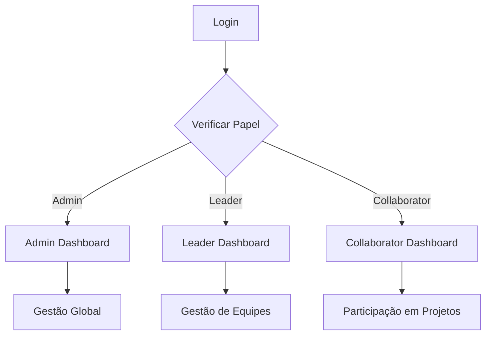

# 🎭 Sistema de Perfis Baseado em Papéis - XMen AgileTeam

## 📋 Visão Geral

O XMen AgileTeam implementa um sistema completo de perfis baseado em papéis (RBAC - Role-Based Access Control) que oferece dashboards especializados e funcionalidades específicas para cada tipo de usuário:

- **👨‍💼 Administrador (Admin)**: Acesso total ao sistema, gestão de usuários e análise global
- **👑 Líder (Leader)**: Criação e gestão de equipes, projetos e membros
- **👨‍💻 Colaborador (Collaborator)**: Participação em projetos e desenvolvimento pessoal

## 🏗️ Arquitetura do Sistema

### Estrutura de Arquivos

```
apps/accounts/
├── profile_views.py          # Views especializadas por perfil
├── views.py                  # Views principais de autenticação
├── urls.py                   # Rotas do sistema
├── models.py                 # Modelo User customizado
└── ...

templates/accounts/
├── admin_dashboard.html      # Dashboard do Administrador
├── leader_dashboard.html     # Dashboard do Líder
├── collaborator_dashboard.html # Dashboard do Colaborador
└── ...
```

### Fluxo de Autenticação



## 👨‍💼 Dashboard do Administrador

### Funcionalidades Principais

#### 📊 Estatísticas Globais
- **Usuários Totais**: Contagem completa de usuários do sistema
- **Times Ativos**: Número de equipes em funcionamento
- **Projetos em Andamento**: Projetos atualmente ativos
- **Skills Cadastradas**: Total de habilidades no sistema

#### 👥 Gestão de Usuários
- **Distribuição por Papel**: Gráfico visual dos tipos de usuário
- **Usuários Recentes**: Lista dos últimos usuários cadastrados
- **Busca Avançada**: Filtros por papel, status e período

#### 📈 Analytics de Performance
- **Taxa de Conclusão**: Média de projetos concluídos
- **Evolução Mensal**: Crescimento do número de usuários
- **Projetos por Status**: Distribuição de estados dos projetos

#### ⚡ Ações Rápidas
- Criar novo usuário
- Gerenciar papéis e permissões
- Configurações do sistema
- Relatórios avançados

### Interface Visual
- **Design**: Gradientes azuis com tema escuro profissional
- **Layout**: Grid responsivo com cards estatísticos
- **Animações**: Efeitos hover e transições suaves
- **Responsividade**: Adaptação completa para mobile

## 👑 Dashboard do Líder

### Funcionalidades Principais

#### 🤖 Criação Inteligente de Equipes
- **IA Integrada**: Sistema de sugestões baseado em algoritmos
- **Análise de Skills**: Matching automático de habilidades
- **Configuração Flexível**: Escolha de tipo de projeto e tamanho
- **Explicação Detalhada**: IA explica suas escolhas e decisões

#### 👥 Gestão de Times
- **Meus Times**: Visualização de equipes lideradas
- **Estatísticas por Time**: Membros, projetos e performance
- **Ações Diretas**: Editar, visualizar e gerenciar times
- **Status em Tempo Real**: Acompanhamento de atividades

#### 📋 Projetos Ativos
- **Visão Unificada**: Todos os projetos sob liderança
- **Status Colorido**: Indicadores visuais de progresso
- **Filtros Inteligentes**: Busca por status, time ou período
- **Métricas de Performance**: Taxa de conclusão e qualidade

#### 🎯 Colaboradores Disponíveis
- **Pool de Talentos**: Lista de desenvolvedores disponíveis
- **Skills Visíveis**: Habilidades e níveis de cada colaborador
- **Disponibilidade**: Status atual e carga de trabalho
- **Histórico de Performance**: Projetos anteriores e avaliações

### Sistema de IA para Times

#### Algoritmo de Matching
```python
def generate_ai_team_suggestion(project_type, team_size, required_skills):
    # 1. Filtra usuários disponíveis
    # 2. Analisa skills necessárias vs disponíveis
    # 3. Considera histórico de colaborações
    # 4. Balanceia seniority levels
    # 5. Otimiza comunicação e sinergia
    # 6. Gera explicação detalhada
```

#### Tipos de Projeto Suportados
- **Desenvolvimento Web**: Frontend, Backend, Full-stack
- **Aplicativo Mobile**: iOS, Android, Cross-platform
- **Ciência de Dados**: ML, Analytics, Big Data
- **DevOps/Infraestrutura**: CI/CD, Cloud, Monitoramento
- **UI/UX Design**: Interface, Experiência, Prototipagem

## 👨‍💻 Dashboard do Colaborador

### Funcionalidades Principais

#### 📊 Progresso Pessoal
- **Círculos de Progresso Animados**: Visualização dinâmica de métricas
- **Taxa de Conclusão**: Percentual de tarefas finalizadas
- **Evolução de Skills**: Progresso no desenvolvimento técnico
- **Participação em Times**: Nível de engajamento colaborativo

#### 👥 Meus Times
- **Participação Ativa**: Times onde é membro
- **Papel Definido**: Função específica em cada equipe
- **Comunicação Direta**: Links para chat e colaboração
- **Projetos Associados**: Trabalhos em andamento

#### 📋 Quadro de Tarefas Kanban
- **Para Fazer**: Tarefas pendentes e priorizadas
- **Em Andamento**: Trabalhos atualmente em execução
- **Concluído**: Entregas finalizadas com sucesso
- **Em Revisão**: Itens aguardando aprovação

#### 🎯 Desenvolvimento de Skills
- **Skills Atuais**: Habilidades cadastradas com níveis
- **Sistema de Pontos**: Progressão visual de 1 a 5 estrelas
- **Recomendações Personalizadas**: Sugestões de crescimento
- **Certificações**: Trilhas de aprendizado sugeridas

#### 💡 Recomendações Inteligentes
- **Expansão de Skills**: Sugestões baseadas no perfil atual
- **Oportunidades de Times**: Vagas compatíveis com habilidades
- **Metas de Performance**: Objetivos personalizados
- **Certificações Sugeridas**: Cursos e validações relevantes

### Sistema de Notificações
- **Tempo Real**: Updates instantâneos de tarefas
- **Push Notifications**: Alertas no navegador
- **Integração com Chat**: Mensagens diretas da equipe
- **Lembretes Inteligentes**: Deadlines e compromissos

## 🎨 Design System e UI/UX

### Paleta de Cores por Perfil

#### Admin Dashboard
```css
/* Azul Profissional */
Primary: linear-gradient(135deg, #2563eb 0%, #7c3aed 100%)
Background: linear-gradient(135deg, #0f172a 0%, #1e293b 100%)
Cards: linear-gradient(135deg, #1e293b 0%, #334155 100%)
```

#### Leader Dashboard
```css
/* Azul/Roxo Liderança */
Primary: linear-gradient(135deg, #2563eb 0%, #7c3aed 100%)
Background: linear-gradient(135deg, #0f172a 0%, #1e293b 100%)
AI Section: linear-gradient(135deg, #7c3aed 0%, #2563eb 100%)
```

#### Collaborator Dashboard
```css
/* Verde Crescimento */
Primary: linear-gradient(135deg, #10b981 0%, #059669 100%)
Background: linear-gradient(135deg, #0f172a 0%, #1e293b 100%)
Progress: linear-gradient(135deg, #10b981 0%, #059669 100%)
```

### Componentes Reutilizáveis

#### Cards Estatísticos
- Gradientes sutis com bordas superiores coloridas
- Animações hover com elevação
- Números grandes e labels descritivos
- Responsividade automática

#### Ações Rápidas Flutuantes
- Botões circulares fixos no canto inferior direito
- Gradientes matching com o tema do perfil
- Efeitos de hover com escala e sombra
- Tooltips informativos

#### Modais Inteligentes
- Backdrop com blur e escurecimento
- Conteúdo centralizado responsivo
- Animações de entrada suaves
- Fechamento por clique fora ou ESC

## 🔐 Sistema de Permissões

### Hierarquia de Acesso
```
Admin (Staff)
├── Acesso total ao sistema
├── Gestão de usuários e papéis
├── Configurações globais
├── Relatórios e analytics
└── Controle de funcionalidades

Leader
├── Criação e gestão de equipes
├── Atribuição de tarefas
├── Visualização de colaboradores
├── IA para formação de times
└── Relatórios de equipe

Collaborator
├── Participação em projetos
├── Gestão de tarefas pessoais
├── Desenvolvimento de skills
├── Comunicação com equipe
└── Dashboards personalizados
```

### Decoradores de Segurança
```python
@login_required
@role_required('admin')
def admin_only_view(request):
    pass

@login_required
@role_required(['admin', 'leader'])
def leadership_view(request):
    pass
```

## 🚀 Funcionalidades Avançadas

### Sistema de IA para Formação de Times

#### Algoritmo de Matching Inteligente
1. **Análise de Skills**: Compatibilidade técnica
2. **Histórico de Colaboração**: Sinergias passadas
3. **Carga de Trabalho**: Disponibilidade atual
4. **Complementaridade**: Balance de seniority
5. **Soft Skills**: Personalidade e comunicação

#### Explicação da IA
```json
{
  "team_composition": {
    "frontend_specialist": "João Silva - React expertise",
    "backend_developer": "Maria Santos - Python/Django",
    "ui_designer": "Pedro Costa - Figma proficiency"
  },
  "reasoning": "Esta combinação oferece...",
  "success_probability": "87%",
  "estimated_timeline": "3-4 sprints"
}
```

### Dashboards Responsivos

#### Breakpoints Principais
- **Desktop**: > 1200px (Layout completo)
- **Tablet**: 768px - 1199px (Grid adaptado)
- **Mobile**: < 767px (Coluna única)

#### Otimizações Mobile
- Navegação por swipe
- Cards verticais expandidos
- Ações rápidas redimensionadas
- Tipografia escalável

## 📊 Métricas e Analytics

### KPIs por Perfil

#### Admin Metrics
- **Adoption Rate**: Taxa de adoção de novas funcionalidades
- **User Engagement**: Tempo médio de sessão por tipo de usuário
- **Team Effectiveness**: Sucesso de projetos por equipe
- **System Health**: Performance e disponibilidade

#### Leader Metrics
- **Team Performance**: Conclusão de projetos no prazo
- **Member Satisfaction**: Feedback da equipe
- **Skill Development**: Evolução técnica dos membros
- **Innovation Index**: Uso de novas tecnologias

#### Collaborator Metrics
- **Task Completion Rate**: Eficiência pessoal
- **Skill Growth**: Progressão técnica mensal
- **Collaboration Score**: Participação em equipes
- **Learning Velocity**: Velocidade de aprendizado

## 🔧 Configuração e Deploy

### Variáveis de Ambiente
```bash
# Configurações de Perfil
ROLE_BASED_REDIRECTS=True
AI_TEAM_GENERATION=True
DASHBOARD_ANALYTICS=True

# Features por Perfil
ADMIN_ADVANCED_ANALYTICS=True
LEADER_AI_SUGGESTIONS=True
COLLABORATOR_GAMIFICATION=True
```

### Migrations Necessárias
```bash
# Aplicar migrações do sistema de usuários
python manage.py makemigrations accounts
python manage.py migrate accounts

# Criar dados de exemplo (opcional)
python manage.py loaddata sample_users
```

## 🎯 Próximos Passos

### Funcionalidades Planejadas

#### Fase 2 - Inteligência Avançada
- [ ] Machine Learning para predição de sucesso de equipes
- [ ] Análise de sentimento em comunicações
- [ ] Recomendações automáticas de upskilling
- [ ] Dashboard preditivo com tendências

#### Fase 3 - Integração e APIs
- [ ] Webhook system para integrações externas
- [ ] API GraphQL para consultas flexíveis
- [ ] Single Sign-On (SSO) com provedores externos
- [ ] Mobile app nativo

#### Fase 4 - Gamificação e Engagement
- [ ] Sistema de pontos e achievements
- [ ] Ranking de colaboradores
- [ ] Badges por conquistas técnicas
- [ ] Challenges mensais de desenvolvimento

### Melhorias Técnicas

#### Performance
- [ ] Cache Redis para dashboards
- [ ] Lazy loading para components pesados
- [ ] CDN para assets estáticos
- [ ] Database indexing otimizado

#### Monitoramento
- [ ] Logs estruturados por ações de usuário
- [ ] Metrics customizadas no Prometheus
- [ ] Alertas proativos de sistema
- [ ] Health checks automatizados

## 📚 Documentação Técnica

### APIs Disponíveis

#### Endpoints de Perfil
```http
GET /api/accounts/profile/            # Perfil do usuário logado
PUT /api/accounts/profile/            # Atualizar perfil
GET /api/accounts/users/              # Lista usuários (leader+)
POST /api/accounts/create-ai-team/    # Gerar sugestão de time
```

#### Dashboard Data
```http
GET /api/accounts/admin-stats/        # Dados do admin dashboard
GET /api/accounts/leader-stats/       # Dados do leader dashboard  
GET /api/accounts/collaborator-stats/ # Dados do collaborator dashboard
```

### Estrutura de Dados

#### User Model Extensions
```python
class User(AbstractUser):
    role = models.CharField(max_length=20, choices=ROLE_CHOICES)
    skills = models.ManyToManyField('skills.Skill')
    teams = models.ManyToManyField('teams.Team')
    
    def is_admin(self):
        return self.is_staff or self.role == 'admin'
    
    def is_leader(self):
        return self.role == 'leader' or self.is_admin()
    
    def is_collaborator(self):
        return self.role == 'collaborator'
```

---

## 🎉 Conclusão

O Sistema de Perfis Baseado em Papéis do XMen AgileTeam oferece uma experiência personalizada e eficiente para cada tipo de usuário, com interfaces especializadas, funcionalidades apropriadas e um sistema de IA integrado para otimização de equipes.

A arquitetura flexível permite expansões futuras mantendo a simplicidade de uso, enquanto o design moderno e responsivo garante uma experiência consistente em todos os dispositivos.

**Status Atual**: ✅ Sistema completo implementado e funcional
**Próxima Etapa**: Testes de integração e refinamentos baseados em feedback